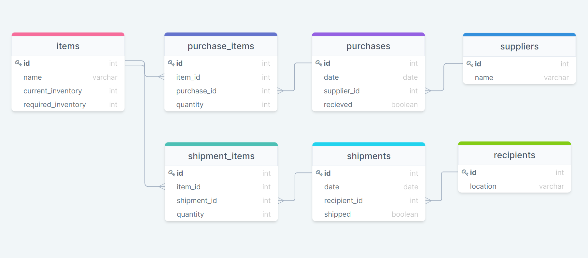
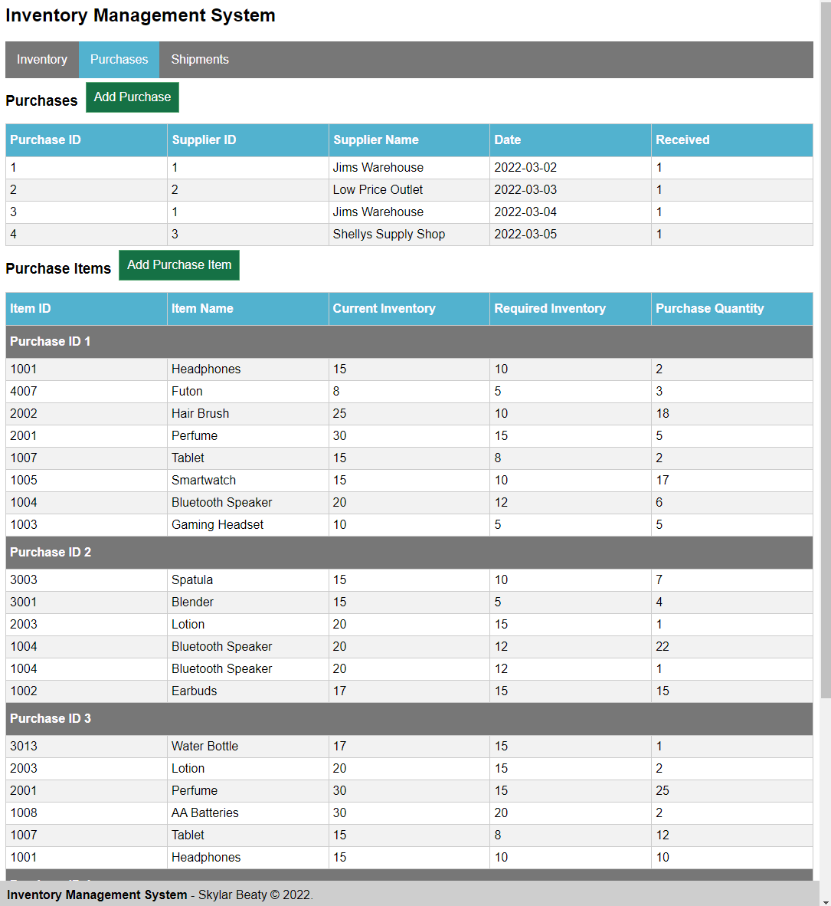
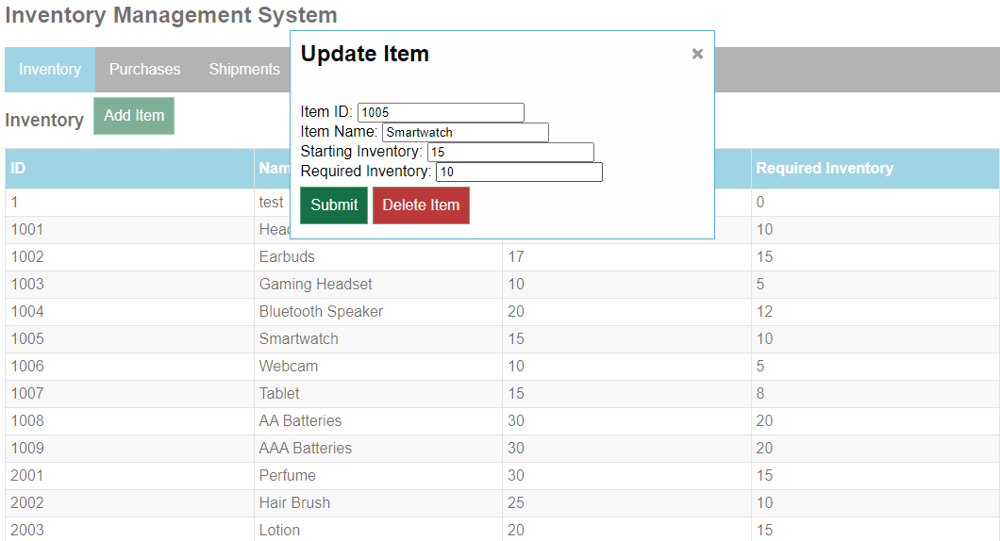

# inventory-mangement
An inventory management application for a retail warehouse. 
This is a system that keeps track of an inventory of items as well as incoming purchases and outgoing shipments.

Made using: php, MySQL, html, css, js.

With software: Draw SQL, Xampp, VS Code, Google Chrome, phpMyAdmin.

This application is a work in progress and its not fully featured.

To run: clone this repo into a (local) server and connect to it in your browser. Use the MySQL code in [databaseSetup.sql](sql/databaseSetup.sql), and [databaseMockData.sql](sql/databaseMockData.sql) to set up the database.


## Server and Database

The app currently runs on a local Apache server through Xampp. Also through Xampp is a MySQL database that was initialized using phpMyAdmin

#### Database Schema


The purchases table holds basic information about the purchases, while purchase_items holds the list of all items in purchases. This way the number of items in a purchase can be arbitrarily long. There is a similar setup for shipments, and shipment_items. 

#### MySQL
Snippets from [databaseSetup.sql](sql/databaseSetup.sql)

```
CREATE TABLE items(
    id INT NOT NULL UNIQUE,
    name VARCHAR(255),
    current_inventory int,
    required_inventory int,
    PRIMARY KEY (id)
);
```
```
CREATE TABLE purchase_items(
    id INT AUTO_INCREMENT,
    item_id INT,
    purchase_id INT,
    quantity INT NOT NULL,
    PRIMARY KEY (id),
    FOREIGN KEY (item_id) REFERENCES items(id),
    FOREIGN KEY (purchase_id) REFERENCES purchases(id)
);
```
## Interfaces
There are 3 pages for viewing the database: *inventory, purchases, and shipments.*

More screen shots avialable in the [images](images) folder.



#### Forms

Items have *create, read, update, delete* functionality. Clicking on a row brings up a modal to update or delete the item. The "Add" buttons work similiarly. Modals send their data to [forms.php](forms.php) which makes changes on the server and redirects back to the original page.



#### php and MySQL
Snipets from [forms.php](forms.php)

*Adding an item to a purchase.*

```
if (!empty($_POST['add_purchase_item_submit'])) {
    $item_id = $_POST['item_id'];
    $purchase_id = $_POST['purchase_id'];
    $quantity = $_POST['quantity'];

    $sql = "INSERT INTO purchase_items(item_id, purchase_id, quantity)
        VALUES ($item_id, $purchase_id, $quantity)";
    if(mysqli_query($connection, $sql)){
        echo "Purchase item added successfully.";
        header("location:purchases.php");   
    } else{
        echo "ERROR: Could not execute $sql. " . mysqli_error($connection);
    }
}
```

*Updating an item.*

```
if (!empty($_POST['update_item_submit'])) {
    $id = $_POST['item_id'];
    $name = $_POST['item_name'];
    $current = $_POST['current_inventory'];
    $required = $_POST['required_inventory'];

    $sql = "UPDATE items
        SET name='$name', current_inventory=$current, required_inventory=$required
        WHERE id=$id";
    if(mysqli_query($connection, $sql)){
        echo "Item updated successfully.";
        header("location:index.php");   
    } else{
        echo "ERROR: Could not execute $sql. " . mysqli_error($connection);
    }
}
```
